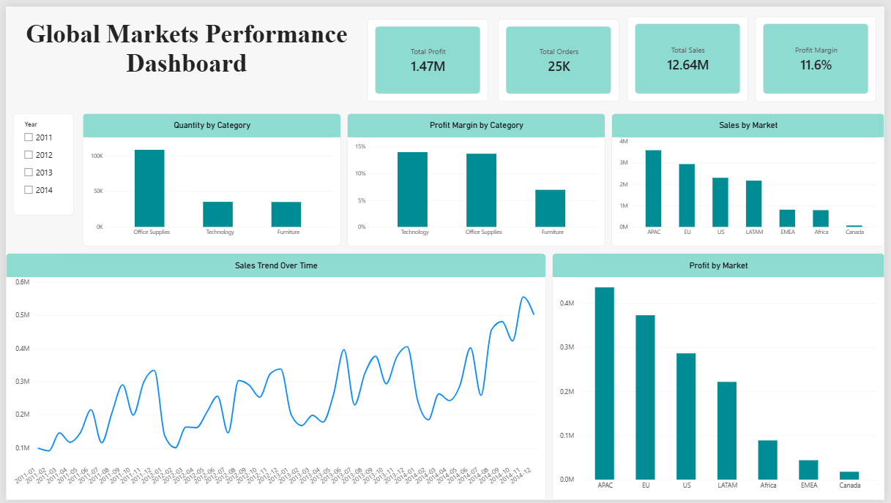
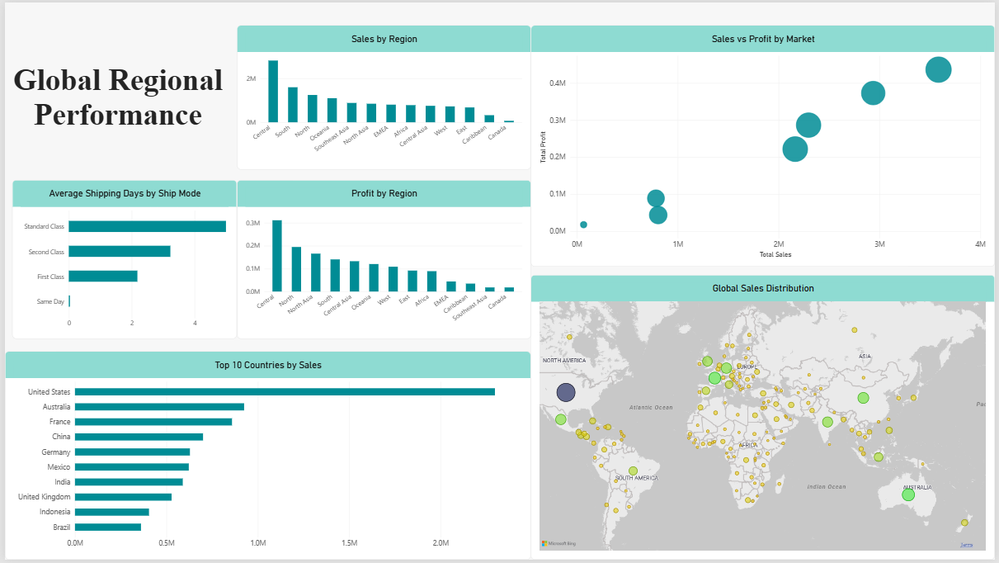
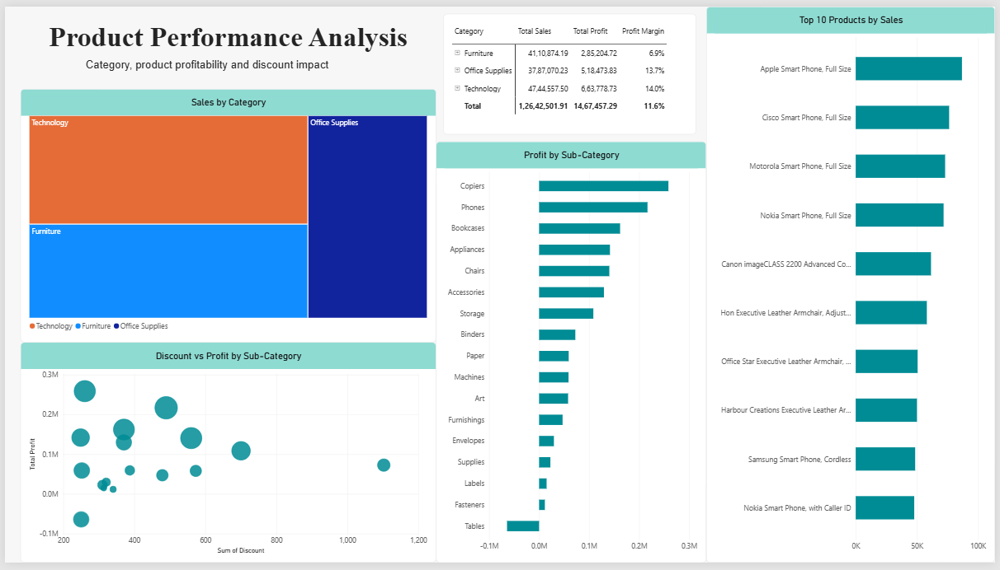

# Global Markets Analytics Dashboard

A multi-page Power BI dashboard developed to analyse market data and communicate business insights through interactive reporting.

## Project Overview

The Global Markets Analytics Dashboard presents market data through interactive Power BI reports, focusing on trends, comparisons, and key performance indicators.

Power Query was used to prepare and transform the source data for reporting and analysis. The dashboard was designed with separate overview, regional, product, and tooltip pages to present different aspects of the data.

## Tools Used

- Power BI
- Power Query
- Data Visualisation

## Dashboard Pages

### 1. Overview

The overview page provides a high-level view of market performance through key performance indicators and visualisations.

It includes:

- Total Sales
- Total Profit
- Total Orders
- Profit Margin
- Sales by Market
- Profit by Market
- Sales trends over time
- Quantity by Category
- Profit Margin by Category

### 2. Regional Analysis

The regional analysis page presents sales, profitability, and operational comparisons across different regions and markets.

It includes:

- Sales by Region
- Profit by Region
- Top 10 Countries by Sales
- Average Shipping Days by Ship Mode
- Global Sales Distribution
- Sales vs Profit by Market

### 3. Product Analysis

The product analysis page focuses on product and category performance.

It includes:

- Sales by Category
- Profit by Sub-Category
- Discount vs Profit by Sub-Category
- Top 10 Products by Sales
- Product Performance by Category and Sub-Category

### 4. Product Tooltip

A dedicated report-page tooltip was created to provide additional product-level information when interacting with product visualisations.

The tooltip displays:

- Product
- Sales
- Profit
- Profit Margin

## Data Preparation

Power Query was used to prepare and transform the source data for reporting and analysis.

The prepared data was used to create the visualisations and key performance indicators presented throughout the dashboard.

A dedicated date table was also used to support time-based analysis.

## Project Structure

~~~text
Global-Markets-Analytics-Dashboard/
│
├── data/
│   └── raw/
│       └── Global_Superstore2.xlsx
│
├── powerbi/
│   └── Global_Markets_Analytics_Dashboard.pbix
│
├── screenshots/
│   ├── overview.png
│   ├── regional-analysis.png
│   └── product-analysis.png
│
├── documentation/
│
├── .gitignore
└── README.md
~~~

> The raw dataset is excluded from Git version control through `.gitignore`.

## Dashboard Focus

The dashboard focuses on:

- Market performance
- Regional comparisons
- Product performance
- Sales and profitability
- Trends
- Key performance indicators
- Interactive reporting

## Project Status

Completed as a Power BI dashboard project for portfolio and data visualisation purposes.
